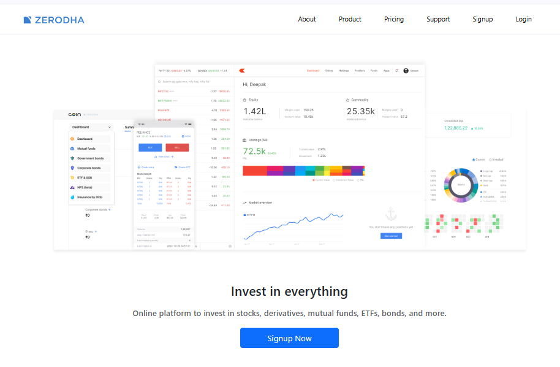
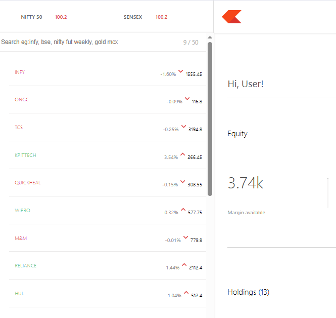
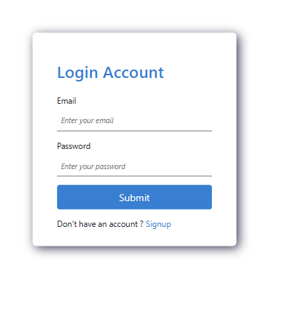
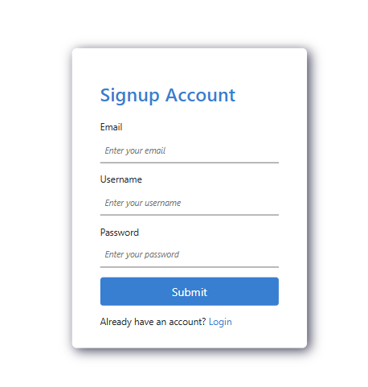
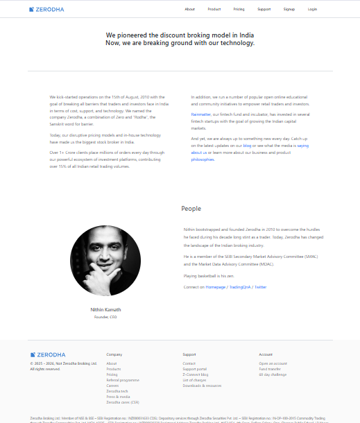
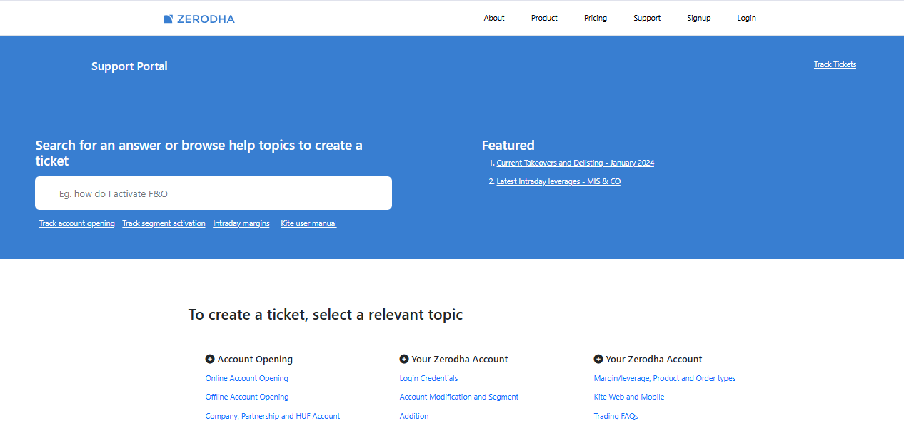
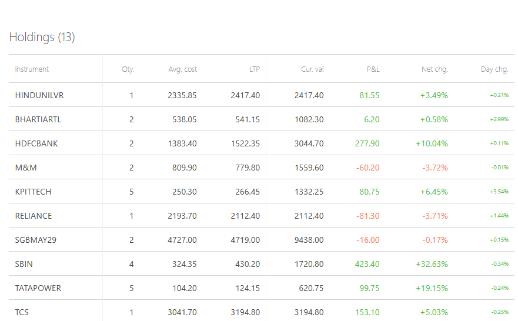

# Zerodha Clone

A full-stack web application inspired by the Zerodha trading platform, featuring a main frontend, a trading dashboard, and backend APIs. Built for learning and portfolio purposes.

## Project Overview

This Zerodha Clone replicates the user experience and interface of India's leading stockbroking platform. The project is designed with React.js for the user interface and Node.js/Express for backend APIs, focusing on modular and scalable code architecture for both the frontend and dashboard. It includes authentication, real-time data simulation, and interactive trading features.

## Project Structure

- `/frontend` - Main landing pages, signup/login, about, pricing.
- `/dashboard` - Trading dashboard UI for holdings, buy/sell, positions, charts.
- `/backend` - Node.js API server for user authentication, trade logic, and data.
- `README.md` - Project documentation.

## Features

- Responsive UI similar to Zerodha’s web platform.
- Component-based React architecture for easy maintenance.
- Authentication using JWT (JSON Web Token) for secure login.
- Dashboard displays holdings, positions, trading charts, and watchlists.
- Interactive order placement (buy/sell stocks).
- Real-time portfolio overview and sample data.
- Modular backend API ready for database integration.

## Installation

### Prerequisites

- Node.js (v16+)
- npm or yarn

### Steps

1. Clone the repository:
   ```
   git clone https://github.com/dnyanu-5/Zerodha-clone.git
   ```
2. Install dependencies for each module:
   ```
   cd frontend && npm install
   cd ../dashboard && npm install
   cd ../backend && npm install
   ```
3. Set up environment variables if needed (backend).
4. Start the backend server:
   ```
   cd backend && npm start
   ```
5. Start the frontend and dashboard in separate terminals:
   ```
   cd ../frontend && npm start
   cd ../dashboard && npm start
   ```

## Tech Stack

Frontend: React.js

Backend: Node.js with Express.js

Database: MongoDB

Styling: CSS

Version Control: Git & GitHub

## Usage

- Visit the landing page to sign up or log in.
- Explore demo trading and the dashboard after authentication.
- View holdings, execute trades, and check statistics on the dashboard.

## Screenshots

### Homepage


### Dashboard


### Login


### Singup


### About page


### Support page


### holdings



## Live Project Links

- [Frontend](https://zerodha-clone-frontend-09mo.onrender.com) — Main user interface
- [Dashboard](https://zerodha-clone-dashboard-o2li.onrender.com) — Trading dashboard
- [Backend API](https://zerodha-clone-backend-oj6q.onrender.com) — API service


## Future Enhancements

- Integration with a real-time stock data API.
- Proper database backend (MongoDB) for live data and authentication.
- Advanced charting and financial analytics.
- Enhanced error handling and transaction validation.
- User roles and admin dashboard.


## Acknowledgements

- Inspired by Zerodha’s platform design and workflow.
- Built using React.js, Node.js/Express, and standard web development best practices.

***